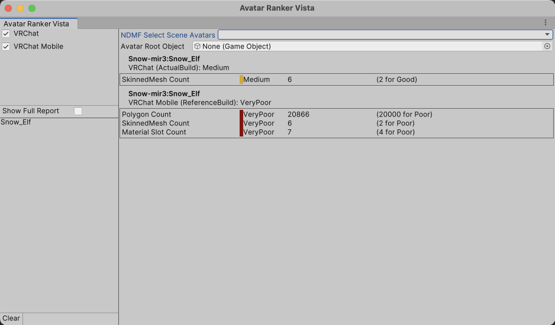

# Avatar Ranker Vista

ビルドされたアバターのパフォーマンスランクや、パフォーマンスランク以外を表示するツールです。

## 動作環境

Avatar Ranker Vistaは結果表示をAbletコンソールに対して行うため、 `ablet:Ablet` が必要です。

`ndmf:NDMF` が入っている場合、NDMFのビルドタイミングで動かすこともできます。

## レギュレーション

レギュレーションとは、アバターのパフォーマンスランク類を決定する基準です。

例えは、VRChatのパフォーマンスランクにはPCとMobileという２つのレギュレーションが存在します。

## 動作

### VRChatアバター

VRCSDKがインストールされている場合、VRChatのアバターに対して以下のように動作します。

- 以下のタイミングでアバターのパフォーマンスランクを計算します。
  - Avatar Ranker Vistaのウィンドウから手動で計算するたび、 `EditMode` としてランクを計算します。
  - アバターのビルド時や非破壊改変ツールによってアバタービルド時の処理が実行されるたび、 `ActualBuild` としてランクを計算します。
- アバターのパフォーマンスランクはVRCSDKのレギュレーションに基づいて計算されます。

PC向けビルドではPCの、PC以外の環境向けビルドではMobileのレギュレーションが適用されます。

Avatar Ranker Vistaは有効になっている全てのプラットフォームについてまとめてランクの計算を行い、アバターと一致しないプラットフォームについては `ReferenceBuild` として記録します。

### VRChatアバター以外

VRChat以外のアバターに対して以下のように動作します。

- パフォーマンスランクのレギュレーションが存在する場合、以下のタイミングでアバターのパフォーマンスランクを計算します。
  - Avatar Ranker Vistaのウィンドウから手動で計算するたび、 `EditMode` としてランクを計算します。
  - NDMFやAbletによってアバタービルド時の処理が実行されるたび、 `ActualBuild` としてランクを計算します。
- アバターのパフォーマンスランクはAvatar Ranker Vistaによって計算されます。

Avatar Ranker Vistaは有効になっている全てのプラットフォームについてまとめてランクの計算を行い、アバターと一致しないプラットフォームについては `ReferenceBuild` として記録します。

## Avatar Ranker Vistaウィンドウ

メニューバーから `Tools` → `Avatar Tinker Vista` → `Avatar Ranker Vista Window` を選択することでAvatar Ranker Vistaのウィンドウを表示します。 

アバターの一番正確なパフォーマンスランクが記録され、ウィンドウに表示されます。

`EditMode` ＜ `ReferenceBuild` ＜ `ActualBuild` の順により正確なパフォーマンスランクとして扱われます。

## 設定

- `Measure On Build`: アバターをビルドするたび、自動的にパフォーマンスランクを計算します。
- `Show Report on Build`: アバターのパフォーマンスランクを計算するたび、自動的にAvatar Ranker Vistaのウィンドウを表示します。

## 注意

このツールはパフォーマンスランクを計算しますが、アバターのアップロードを妨げるような設定の不備がないことを保証するものではありません。

## 拡張

`Silksprite.AvatarRankerVista.API` 以下、および `Silksprite.AvatarRankerVista.Generic` 以下は公開APIです。

「俺のアバターは軽い」と思う方は、独自のレギュレーションを実装してAvatar Ranker Vistaに登録することで、独自のパフォーマンスランクの計測方法を定義して追加できます。

UniVRMがインストールされている場合、clusterのVRM 1.0アバターにかかる制限をチェックするビルトイン拡張が自動的に有効になります。

:::note[NOTE]
実はVRChatアバターのパフォーマンスランク計測もAvatar Ranker Vistaのビルトイン拡張として実装されています。
:::
