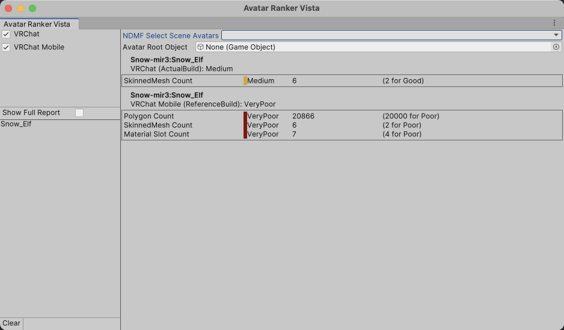

# Avatar Ranker Vista

<PlatformBadge id="VRChat" />
<PlatformBadge id="UniVRM0" />
<PlatformBadge id="UniVRM1" />

ビルドされたアバターのパフォーマンスランクや、パフォーマンスランク以外を表示するツールです。

## 動作環境

Avatar Ranker Vistaは結果表示をAbletコンソールに対して行うため、 `ablet:Ablet` が必要です。

`vrc:VRCSDK` が入っている場合、 VRCSDK のビルドタイミングで動作します。

`ndmf:NDMF` が入っている場合、NDMFのビルドタイミングで動作します。

## パフォーマンスランク

パフォーマンスランクとは、アバターの様々な計測値から求められるアバターの最適化指標です。

パフォーマンスランクが優れているアバターが軽いとは限りませんが、パフォーマンスランクが優れているアバターは適切に最適化されていることが期待されます。

## レギュレーション

レギュレーションとは、アバターのパフォーマンスランク類を決定する基準です。

例えは、VRChatのパフォーマンスランクにはPCとMobileという２つのレギュレーションが存在します。

## Avatar Ranker Vistaウィンドウ

メニューバーから `Tools` → `Avatar Tinker Vista` → `Avatar Ranker Vista Window` を選択することでAvatar Ranker Vistaのウィンドウを表示します。 

アバターの一番正確なパフォーマンスランクが記録され、ウィンドウに表示されます。

`EditMode` ＜ `ReferenceBuild` ＜ `ActualBuild` の順により正確なパフォーマンスランクとして扱われます。

## 設定

- `Measure On Build`: アバターをビルドするたび、自動的にパフォーマンスランクを計算します。
- `Show Report on Build`: アバターのパフォーマンスランクを計算するたび、自動的にAvatar Ranker Vistaのウィンドウを表示します。

## 注意

このツールはパフォーマンスランクを計算しますが、アバターのアップロードを妨げるような設定の不備がないことを保証するものではありません。
