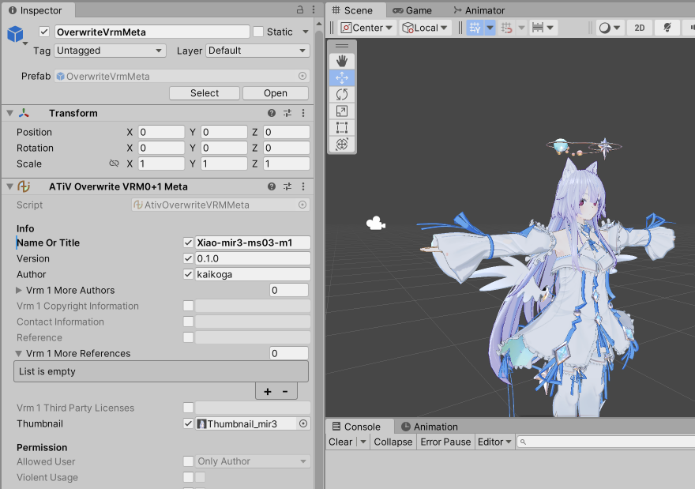

# Avatar Tinker Vista

たまに役に立つ小さい単機能アバターツールの詰め合わせです。

GitHub: https://github.com/kaikoga/AvatarTinkerVista-Unity

## 特徴

- 単純
  - 使えます
  - 設計を凝らず、素早くシンプルに実装されます
- 単機能:
  - 必須な依存性は最低限に絞ってあります。Unity単体で動く機能はVRCSDK不要で動きます
  - フレームワークではない、単機能ツールの寄せ集めです
- 短期サポート:
  - 長期的なサポートはありません
  - 依存ツールのアップデートで動かなくなる可能性はありますが、プロジェクトを壊すことはないようになっています

## 収録コンポーネント

「Component」 → 「Avatar Tinker Vista」 でコンポーネントを追加してください。

:::info[INFO]
一部のコンポーネントは、いわゆる非破壊編集ワークフローをサポートしたり、いわゆる非破壊編集ワークフローを前提とします。

非破壊編集ワークフローを有効にするには `ndmf:NDMF` または `ablet:Ablet` のいずれかが必要です。
:::

## 収録ツールの使い方

「Window」 → 「Avatar Tinker Vista」 からウィンドウを開いてください。
