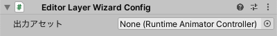
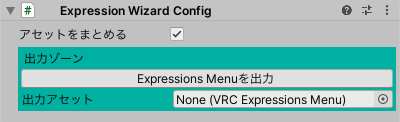
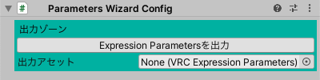
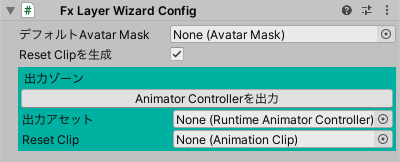
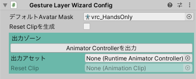
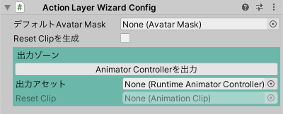

# Configとは

Emote Wizardの細かい挙動を制御するコンポーネントです。
ほとんどの場合、設定を変更する必要はありません。

:::info[出力ゾーン]
「出力ゾーン」は `アセットを永続化` をオフにした場合は表示されません。
:::

## Editor Layer Wizard Config

- `出力アセット`: 生成されたAnimator Controllerアセットがここにセットされます。

## Expression Wizard Config

- `アセットをまとめる`: オンにした場合、生成されるExpressions Menuアセットが１ファイルにまとまります。
- `Expression Menuを出力`: Expressions Menuアセットを生成します。
- `出力アセット`: 生成されたExpressions Menuアセットがここにセットされます。

## Parameters Wizard Config

- `出力アセット`: 生成されたExpression Parametersアセットがここにセットされます。

## Fx Wizard Config

### 設定

- `デフォルトAvatar Mask`: Animator Controllerの各レイヤーにセットするAvatar Maskをここで指定します。  
  省略した場合は、デフォルト値が使用されます。  
  （Gesture Layerの場合は両手のみ有効 / それ以外の場合は全体が有効）
- `Reset Clipを生成`: オンにした場合、レイヤー内のアニメーションで動かされているプロパティをリセットするアニメーションクリップを生成します。
  アニメーションの影響を受けないプロパティがシーン上の状態に戻ります。
- `出力アセット`: 生成されたAnimator Controllerアセットがここにセットされます。
- `Reset Clip`: 自動生成されたリセットのアニメーションがここにセットされます。編集は不要です。

## Gesture Wizard Config

Fx Wizard Configと初期値は異なりますが、内容は同じです。

## Action Wizard Config

Fx Wizard Configと初期値は異なりますが、内容は同じです。
