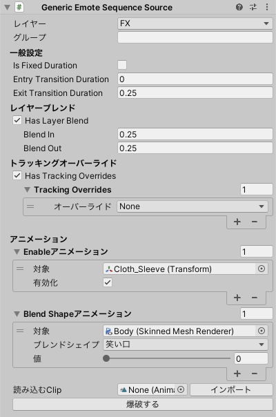

# Generic Emote Sequence Source

**Emote Item Source** で再生されるアニメーションを、ブレンドシェイプ名で指定します。

**Generic Emote Sequence Source** より作成が簡単で、汎用的なアニメーションが作成可能です。

- `レイヤー`: このアニメーションがどのレイヤーに所属するか
- `グループ`: アニメーションの排他制御を行います。グループが同じアニメーションごとに、いずれか１つのアニメーションが選択されます。

## 一般設定

- `Is Fixed Duration`: オンの場合、遷移時間を秒数で指定します。
- `Entry Transition Duration`: アニメーション再生開始時の遷移時間です。
- `Exit Transition Duration`: アニメーション再生終了時の遷移時間です。

## レイヤーブレンド

- `Has Layer Blend`: オンの場合、ActionレイヤーのLayer Blendが設定されます。

## トラッキングオーバーライド

- `Tracking Overrides`: このアニメーションを再生中、まばたきやリップシンク、その他のトラッキングを無効にしてアニメーションの動作を再生します。まばたきを固定する際は `Eyes` 、リップシンクを固定する場合は `Mouth` を設定してください。

:::note[NOTE]
トラッキングオーバーライドを制御する専用のステートマシンが作成されます。
:::

## アニメーション

- `Enableアニメーション`: GameObjectの有効・無効を設定します。
- `Blend Shapeアニメーション`: SkinnedMeshRendererのブレンドシェイプの値を設定します。
- `インポート`: Animation Clipのアニメーションデータのうち、対応しているものをこの **Generic Emote Sequence Source** に読み込みます。
