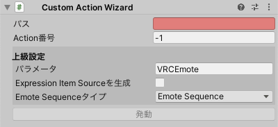

# Custom Action Wizard

いわゆるActionエモート用の **Emote Item Source** を生成します。
カスタムエモートはActionレイヤーに追加されます。

- `パス`: メニューアイテムの生成先です。
- `アクション番号`: パラメータ（初期設定では、 `VRCEmote` ）の数値を設定します。
- `パラメータ`: パラメータ名を設定します。
- `Expression Item Sourceを生成` オンにした場合、 **Expression Item Source** が生成されます。
- `Emote Sequenceタイプ`: **Emote Sequence Source** または **Generic Emote Sequence Source** を選択します。
