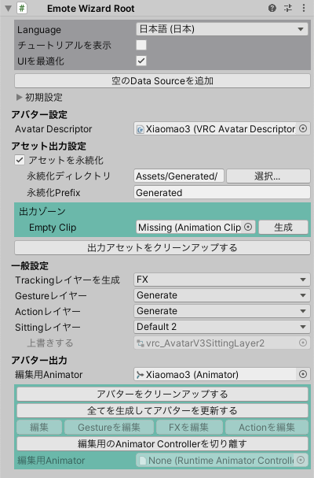

# Emote Wizard Root

ヒエラルキーを右クリック、またはメニューバーの `GameObject` → `Emote Wizard` → `Emote Wizard Root` で、ヒエラルキーに `Emote Wizard` が追加されます。
Emote Wizardの各種設定やアバターへの反映は全てこのオブジェクトを起点として行います。

- `Language`: 表示する言語を設定します。
- `チュートリアルを表示`: Emote Wizardのコンポーネントに簡単な説明を表示します。
- `UIを最適化`: オフにした場合、アバターのプラットフォームに関わらず全ての設定UIが表示されます。  
  オンにした場合、アバターのプラットフォームに関係のある設定UIのみ表示されます。
- `空のData Sourceを追加`: 空のデータソースを追加します。
  例えば、特定のアバターのみに実装する着せ替えに関する設定をまとめて有効化・無効化したりできます。
- `初期設定`:
  - `デフォルトのData Sourceを全て生成`: デフォルトのData Sourceを全て生成します。  
    デフォルトのData Sourceは以下の内容を含みます。
    - 空のExpression Sources
    - 空のParameter Sources
    - VRChat標準のハンドサインで表情を切り替えるように設定された空のFXレイヤー
    - VRChat標準のハンドサインが設定されているGestureレイヤー
    - VRChat標準のエモートが設定されているActionレイヤー  
    :::note[NOTE]
    UniVRMがインポートされている場合、VRM用のデフォルトのData Sourceが作成できます。
    :::
  - `Configを全て生成`: Configを全て生成します。
    ConfigはEmote Wizardの出力を制御する追加のコンポーネントです。

## アバター設定

- `Avatar Root Transform`: アバターへの参照を手動で設定する場合、ここに設定します。
- `Avatar Descriptor`: Avatar Descriptorへの参照を手動で設定する場合、ここに設定します。

## アセット出力設定

- `アセットを永続化`:
  - オンにした場合、生成アセットは指定されたディレクトリに出力され、ビルドのたびに上書きされます。
  - オフにした場合、生成アセットは一時的なディレクトリに出力され、ビルドのたびに消去されます。
- `永続化ディレクトリ`: 
  `アセットを永続化` をオンにした場合の出力先ディレクトリです。 
- `永続化Prefix`:
  `アセットを永続化` をオンにした場合の出力アセットのファイル名の先頭に付与される文字列です。
- `Empty Clip`: Emote Wizardが出力するアセットが利用する空のAnimation Clipです。
- `出力アセットをクリーンアップする`: 出力アセットへの参照をアバターから取り除きます。

:::note[NOTE]
NDMFからEmote Wizardを利用する場合、 `アセットを永続化` をオンにする必要はありません。
:::

:::info[出力ゾーン]
「出力ゾーン」は `アセットを永続化` をオフにした場合は表示されません。
:::

## 一般設定

- `Trackingレイヤーを生成`: Tracking Controlの制御を追加するレイヤーを選択します。
- `Gestureレイヤー`: Gestureレイヤーのコントローラーを選択できます。
  - `Generate`: Emote Wizardが生成したコントローラーに置き換わります。
  - `Override`: 指定したコントローラーに置き換わります。
  - `Default 1`: `vrc_AvatarV3HandsLayer` が設定されます。
  - `Default 2`: `vrc_AvatarV3HandsLayer2` が設定されます。
- `Actionレイヤー`: Actionレイヤーのコントローラーを選択できます。
  - `Generate`: Emote Wizardが生成したコントローラーに置き換わります。
  - `Override`: 指定したコントローラーに置き換わります。
  - `Default`: `vrc_AvatarV3ActionLayer` が設定されます。
- `Sittingレイヤー`: Sittingレイヤーのコントローラーを選択できます。
  - `Override`: 指定したコントローラーに置き換わります。
  - `Default 1`: `vrc_AvatarV3SittingLayer` が設定されます。
  - `Default 2`: `vrc_AvatarV3SittingLayer2` が設定されます。
- `Authorを設定 (VRM)`: VRM出力を行う場合、Authorが未設定の場合に上書きする値を指定します。

## アバター出力

- `編集用Animator`: アップロードするアバターを直接編集せず、別のGameObjectでアニメーションや表情の設定を行いたい場合、ここにセットしてください。
  ここが空の場合は `Avatar Descriptor` にセットされたAnimatorが以下のアニメーション編集用ボタンで使われます。
- `全てを生成してアバターを更新する`: 全てのセットアップを実行します。
- `編集`: アバターに含まれるアニメーションを編集するために、自動生成された編集用のAnimator Controllerを一時的に設定します。
- `Gesture`: アニメーションを編集するために、AnimatorにGestureレイヤーのAnimator Controllerを一時的に設定します。
- `FXを編集`: （同上）FXレイヤーのAnimator Controllerを一時的に設定します。
- `Actionを編集`: （同上）ActionレイヤーのAnimator Controllerを一時的に設定します。
- `編集用のAnimator Controllerを切り離す`: 上記のボタンで設定されたAnimator Controllerを取り除きます。

