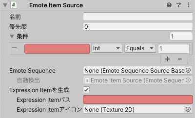

# Emote Item Source

VRChatアバターのExpression Parameterに連動するアニメーションをここに登録します。
Expression ParameterはハンドサインやExpression Menuから変更されるため、ハンドサインやExpression Menuで動く表情や着せ替えを実装できます。

アニメーションの内容は **Emote Sequence Source** または **Generic Emote Sequence Source** で設定します。

- **Emote Sequence Source** は詳細な設定が可能です。
- **Generic Emote Sequence Source** は作成が簡単です。

:::note[NOTE]
`デフォルトのData Sourceを全て生成` した場合、FX / Gesture / Action レイヤーを実装する Emote Item Source が生成されます。
:::

- `名前`: Emote Itemにわかりやすい名前をつけることができます。
- `優先度`: 同じグループに属する複数のアニメーションが条件を満たした場合、優先度の小さいアニメーションが選択されます。
  グループは **Emote Sequence Source** または **Generic Emote Sequence Source** で設定します。
- `条件`: アニメーションを再生する条件を設定します。
- `Emote Sequence`: 再生するアニメーションの内容がここに検出されるか、手動で設定します。
- `Expression Itemを生成`: オンにすると、簡易的なメニュー項目を生成します。
  :::note[NOTE]
  `Expression Itemを生成` は以下の条件を満たす時に利用できます。
  - `条件` が１つ
  - 型が `Auto` または `Int`
  - 演算子が `Equals`
  :::
  - `Expression Itemパス`: メニューアイテムの生成先です。
  - `Expression Itemアイコン`: 生成されるメニューアイテムのアイコンです。

