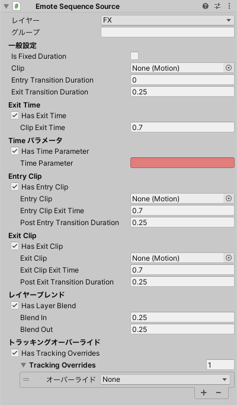

# Emote Sequence Source

`uc:EmoteItemSource` で再生されるアニメーションを、Animation Clipで指定します。

`uc:GenericEmoteSequenceSource` よりきめ細やかな制御が可能です。

- `レイヤー`: このアニメーションがどのレイヤーに所属するか
- `グループ`: アニメーションの排他制御を行います。グループが同じアニメーションごとに、いずれか１つのアニメーションが選択されます。

## 一般設定

- `Is Fixed Duration`: オンの場合、遷移時間を秒数で指定します。
- `Clip`: 再生されるアニメーションクリップです。
- `Entry Transition Duration`: アニメーション再生開始時の遷移時間です。
- `Exit Transition Duration`: アニメーション再生終了時の遷移時間です。

## Exit Time

- `Has Exit Time`: オンの場合、時間経過でアニメーションが再生終了します。

## Timeパラメータ

- `Has Time Parameter`: オンの場合、パラメータからアニメーションの再生位置を指定できます。

## Entry Clip

- `Has Entry Clip`: オンの場合、アニメーション再生開始前に挿入されるアニメーションを設定できます。

## Exit Clip

- `Has Exit Clip`: オンの場合、アニメーション再生終了後に挿入されるアニメーションを設定できます。

## レイヤーブレンド

- `Has Layer Blend`: オンの場合、ActionレイヤーのLayer Blendが設定されます。

## トラッキングオーバーライド

- `Tracking Overrides`: このアニメーションを再生中、まばたきやリップシンク、その他のトラッキングを無効にしてアニメーションの動作を再生します。まばたきを固定する際は `Eyes` 、リップシンクを固定する場合は `Mouth` を設定してください。

:::note[NOTE]
トラッキングオーバーライドを制御する専用のステートマシンが作成されます。
:::
