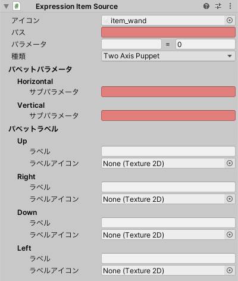

# Expression Item Source

VRChatアバターにExpressions Menuを追加します。
 
- `アイコン`: 生成されるメニューアイテムのアイコンです。
- `パス`: メニューアイテムの生成先です。
- `パラメータ`: メニューアイテムを選択した際にセットされるパラメータです。
- `種類`: メニューアイテムの種類です。
  選択内容に応じて追加の項目が表示されます。
