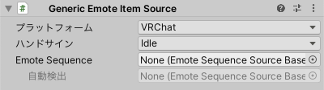

# Generic Emote Item Source

既定の条件に連動するアニメーションをここに登録します。

アニメーションの内容は `ew:GenericEmoteSequenceSource` で設定します。

:::warning[WARNING]
`ew:GenericEmoteItemSource` に `ew:EmoteSequenceSource` をセットすることはできますが、動作しません。 
:::

- `プラットフォーム`: このGeneric Emote Item Sourceの対象となるプラットフォームを指定します。
- `ハンドサイン`: VRChatのアバターを出力する場合、指定したハンドサインに対応するアニメーションとして振る舞います。
- `VRM0 ブレンドシェイプ`: VRM0.xのアバターを出力する場合、指定したブレンドシェイプに対応するアニメーションとして振る舞います。
- `VRM1 Expression`: VRM1.0のアバターを出力する場合、指定したExpressionに対応するアニメーションとして振る舞います。
- `Emote Sequence`: 再生するアニメーションの内容がここに検出されるか、手動で設定します。
