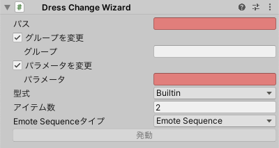

# Dress Change Wizard

一つのパラメータで切り替わる一連の `uc:EmoteItemSource` を生成します。

着せ替えパターンはFXレイヤーに追加されます。

- `パス`: メニューアイテムの生成先です。
- `グループ`: グループを設定します。
- `パラメータ`: パラメータを設定します。
- `型式`: メニューアイテムを選択します。
  - `Builtin`: `uc:ExpressionItemSource` は生成されません。サブメニュー内のトグルで切り替えます。
  - `Toggle Items`: サブメニュー内のトグルで切り替える `uc:ExpressionItemSource` を生成します。
  - `Simple Toggle`: トグルから２つの着せ替えパターンを切り替える `uc:ExpressionItemSource` を生成します。
  - `Simple Radial`: ラジアルパペットから切り替える `uc:ExpressionItemSource` を生成します。
- `アイテム数` 着せ替えのパターン数を設定します。
- `Emote Sequenceタイプ`: `uc:EmoteSequenceSource` または `uc:GenericEmoteSequenceSource` を選択します。
