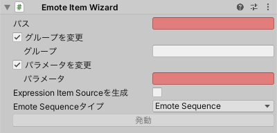

# Emote Item Wizard

単発の **Emote Item Source** を生成します。

表情や着せ替えパターンはFXレイヤーに追加されます。

- `パス`: メニューアイテムの生成先です。
- `グループ`: グループを設定します。
- `パラメータ`: パラメータを設定します。
- `Expression Item Sourceを生成`: オンにした場合、 **Expression Item Source** が生成されます。
- `Emote Sequenceタイプ`: **Emote Sequence Source** または **Generic Emote Sequence Source** を選択します。
