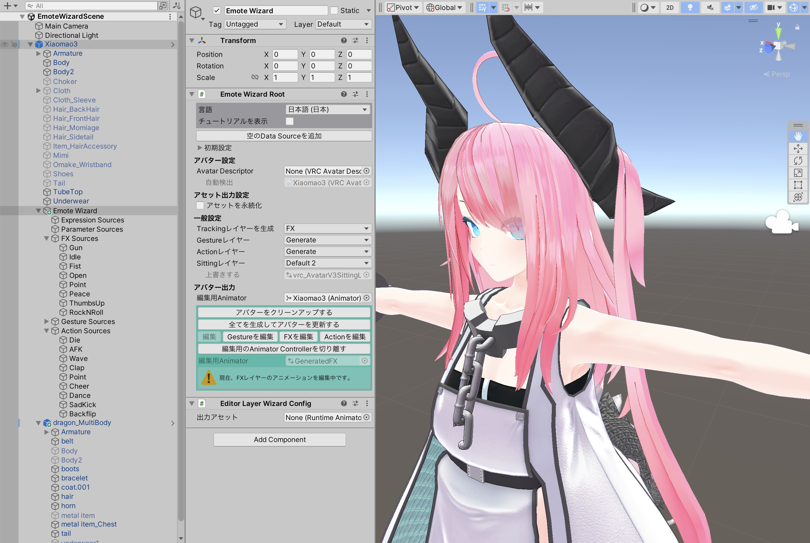

# Emote Wizard

## これは何？

アバターの表情や着せ替えアニメーションのセットアップを支援するツールです。

## 動作環境

Emote Wizardを利用するためには以下の環境が必要です。

- Unity 2022 以上
- VRChatアバターを編集する場合、VRCSDK Avatars 3.5.0 以上

NDMFおよびModular Avatarを利用する場合に自動的に有効になる追加の機能があります。

- NDMFがインストールされている場合、Emote WizardはNDMFのプラグインとして動作します。
- Emote WizardがNDMFのプラグインとして動作する場合、Generatingフェーズで動作します。
- NDMFを利用した上で、プロジェクトにUPM経由でUniVRMがインポートされている場合、VRM0.xおよびVRM1.0 出力をサポートします。

### 動作確認環境

Emote Wizardは以下の環境で動作を確認しています。

- Unity 2022.3.6f1
- 最新のVRCSDK Avatars
- 最新のNDMF
- 最新のUniVRM

これ以外の環境でも動作するかもしれませんが、自己責任でお願いします。
また、上記の環境を満たしている場合も、動作保証や他のツールとの相性などのサポート対応は致しかねる場合があります。
ご了承ください。

## 利用条件

本ソフトウェアはMIT Licenseにて配布いたします。
私的利用を超えた範囲で利用または再配布を行う場合は、MIT Licenseの条件に従ってください。

また、kaikogaは、Emote Wizardの正常動作に関して一切の保障をいたしません。
このドキュメントではUnityの基本操作も特に説明はいたしません。
