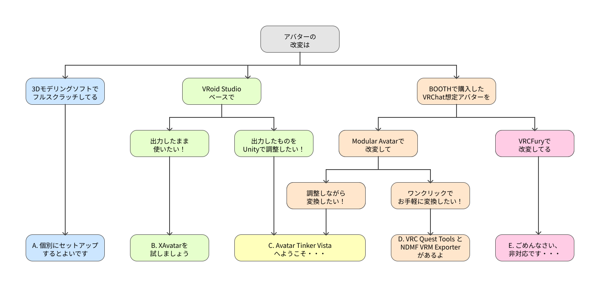

# アバター変換 簡易診断

世の中には様々なアバター変換ツールがあります。
まずは Avatar Tinker Vista があなたに適しているかどうか、以下のフローチャートで調べましょう。

:::info[INFO]
このページの内容はある種の占いです。真に受けすぎないでください。
:::

## 簡易診断フローチャート



### A. 個別にセットアップするとよいです

```
アバターフォーマットに縛られるのではなく、アバターフォーマットを利用するあなたへ。
```

3Dモデリングソフトの使い手であるあなたは、おそらく既にアバターを１からセットアップしているはずです。

3Dモデリングソフトで直せるデータは3Dモデリングソフトの上で直してしまう選択肢があります。
簡単に変換できるツールを使っても良いですが、それはどちらかというと他の利用者のためになるでしょう。

### B. XAvatarを試しましょう

```
VRoidをメインで利用していて、VRChatに書き出す機会もあるプレイスタイルのあなたへ。
```

どちらかというとVRoidの機能を活用することが多いのであれば、 VRoid Studio の中でできることは VRoid Studio の中でやってしまうのも手です。

最近はVRChat向けアバターへの変換も VRoid Studio でできるようになったとか？

### C. Avatar Tinker Vista / Ablet へようこそ・・・

```
全ての改変をプラットフォームを問わず全ての場所に持ち出したい欲張りなあなたへ。
```

Unityで複数プラットフォームに向けてアバターを個別に最適化したい場合、 Avatar Tinker Vista がたぶん便利です。

もとより非破壊改変ツールで全自動で全てのプラットフォームに対して品質の高い変換を行うのは少々無理があります。
NDMFプラグインがどのように Apply on Play でアバターを変換するのかを想像しながら設定を弄るくらいなら、プラットフォーム別にアバターのマテリアルや Prefab Variant を用意しましょう。
破壊的非破壊改変をしましょう。

### D. VRC Quest Tools と NDMF VRM Exporter があるよ

```
VRChatをメインで利用していて、必要に応じてVRChat以外のフォーマットに書き出すプレイスタイルのあなたへ。
```

Modular Avatar 周辺ツールをメインで利用している人は、（アバターが複雑なギミックを含まなければ）既にお手軽にQuest/VRM対応できる時代になっています。

VRC Quest Tools と NDMF VRM Exporter は、いずれもアバターに追加したコンポーネントの指示に従うだけでほぼ自動で非破壊的にQuest/VRM対応を行います。
ちょっとだけ試してみるならこれが一番お得です。

### E. ごめんなさい、非対応です・・・

```
VRChatが世界の全てだと思うスタイルのあなたへ。
```

世の中には、VRChat PC向けアバター専用の改変ツールが存在します。

そのようなツールはQuestやVRM出力を行うことを想定しておらず、想定外のアバターを扱うことができません。

とはいえ、VRChatから外に出ないのであればそれで十分という考え方もあります。
それもまた人生・・・
