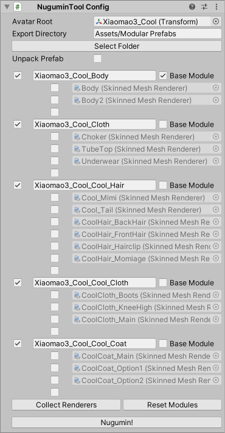

# Modularizer (a.k.a. NuguminTool)

See https://kaikoga.booth.pm/items/5077401

VPM https://vpm.kaikoga.net/

Modular Avatar https://modular-avatar.nadena.dev/ja/

## How to use

1. Select your avatar and select from menubar
   [ GameObject ] → [ NuguminTool ] → [ NuguminTool Config ]
   or [ Component ] → [ NuguminTool ] → [ NuguminTool Config ]
2. Set Avatar Root to your avatar (if it is not set)
3. [ Select Folder ] would change your Export Directory
4. [ Unpack Prefab ] would unpack prefab on Nugumin!, literally, if checked
5. Avatar is modularized per material by default.
   Mesh to module mappings can be configured below.
   - [ ＋ ] Create new module with checked meshes
   - [ ↑ ] Merge checked meshes into module above
   - [ ↓ ] Merge checked meshes into module below
6. Press [ Nugumin! ] when all configurations are set
