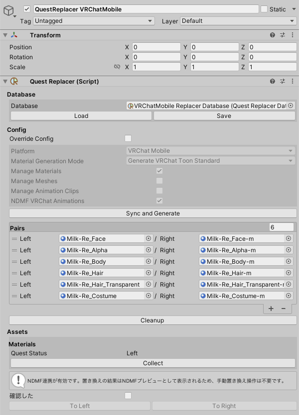

# Quest Replacer

`GameObject` → `QuestReplacer` 以下の項目を選択することで、 `uc:QuestReplacer` コンポーネントのついたオブジェクトをアバター以下に生成します。

QuestReplacerの設定はこのコンポーネントと、 `uc:QuestReplacerDatabase` で行います。

:::info[INFO]
QuestReplacerの能力を最大限に引き出すには、 `uc:QuestReplacerDatabase` が必要になります。
:::

`uc:QuestReplacerDatabase` は、 `uc:QuestReplacer` の `Database` に設定されます。

## QuestReplacerの設定

QuestReplacer の一部の挙動は、 `uc:QuestReplacer` の `Override Config` を有効にすることで上書き可能です。

- `Platform`
  - QuestReplacerの対象プラットフォームを指定します。
    メニューから `uc:QuestReplacer` を生成する場合の初期設定や、NDMFプレビューを有効にする条件に関わります。 
- `Material Generation Mode`
  - 置き換えマテリアル自動生成の挙動を変更します。
    [拡張コンバート](ext_convert.md) も参照してください。 
- `Manage Materials`
  - このQuestReplacerでマテリアルを扱うものとして設定します。
- `Manage Meshes`
  - このQuestReplacerでメッシュを扱うものとして設定します。
- `Manage Animation Clips`
  - このQuestReplacerでアニメーションクリップを扱うものとして設定します。
- `NDMF VRChat Animations`
  - 有効にした場合、NDMFの非破壊編集時に限りアニメーションクリップ内部のマテリアルも置き換えの対象になります。

## QuestReplacerの操作

### Sync and Generate

`Sync and Generate` を押すことで、自動で `uc:QuestReplacer` とデータベースの更新を行います。
一般的なユースケースで有効です。

### 詳細な操作

`Pairs` 以下のUIは、置き換えパターンを細かく操作したい時に使います。
これらの操作はデータベースを更新しないため、最後にデータベースへのセーブを行うことを推奨します。

主なボタンについて説明します。

- `+`
  - 置き換えペアに対して、置き換えマテリアルを自動生成します。
- `Cleanup`
  - 未指定の置き換えペアを `uc:QuestReplacer` から取り除きます。
- `Collect`
  - マテリアルやメッシュ、アニメーションクリップを収集して、未設定の置き換えペアを `uc:QuestReplacer` に追加します。
- `To Left` / `To Right`
  - 置き換えペアを破壊的に適用します。 `Platform` 設定は無視されます。
