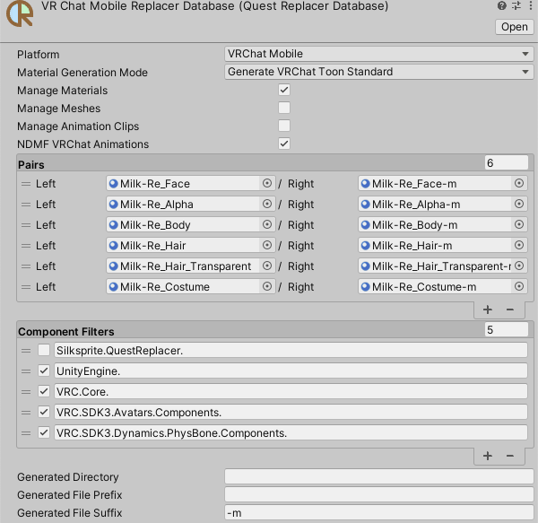

# Quest Replacer Database

同じようなマテリアルの置き換えを行うアバターを複数のシーンで設定している場合、置き換えパターンをデータベースにセーブ・ロードすることで一元管理できます。

:::info[INFO]
`uc:QuestReplacerDatabase` はプラットフォームごとに最低１つ作成されます。
:::

## ロード

`uc:QuestReplacer` でロード操作を行うことで、 `uc:QuestReplacerDatabase` に保存された置き換えパターンをアバターに読み込みます。

ロード操作を行うには、 `Database` のすぐ下にある `Load` ボタンを押してください。

:::info[INFO]
`Collect` 操作ではアバターに含まれる全てのマテリアル等を収集しますが、データベースの置き換えパターンは参照しません。

`Load` 操作ではデータベースが置き換えパターンを知っているマテリアルについて、置き換えパターンをアバターに追加します。
:::

## セーブ

`uc:QuestReplacer` でセーブ操作を行うことで、 `uc:QuestReplacerDatabase` に置き換えパターンを追加できます。
セーブ操作を行わない場合、置き換えパターンや生成済みマテリアルへの参照は `uc:QuestReplacer` コンポーネントのみが保持し、他のアバターからは参照できません。

セーブ操作を行うには、 `Database` のすぐ下にある `Save` ボタンを押してください。

:::tip[TIPS]
特に、置き換えマテリアルを自動生成した後はセーブを行うことをお勧めします。
:::

## データベースの設定

- `Pairs`
  - データベースに保存された置き換えパターンです。
- `Component Filters`
  - アセットを収集する対象のコンポーネントの型名がここに記録されます。
- `Generated Directory`
  - `Assets/` で始まるディレクトリをここに指定することで、生成されたマテリアルを特定のディレクトリに保存できます。
  - ここを空欄にした場合、生成されたマテリアルは元のマテリアルと同じディレクトリに生成されます。
- `Generated File Prefix`
  - 生成されたマテリアルのファイル名の最初につける接頭辞を設定します。
- `Generated File Suffix`
  - 生成されたマテリアルのファイル名の最後につける接尾辞を設定します。

:::tip[TIPS]
Unityのマテリアルアセット選択UIにはマテリアルのファイル名しか表示されないため、 `Generated File Prefix` と `Generated File Suffix` のどちらかを設定しておくことをお勧めします。
:::
