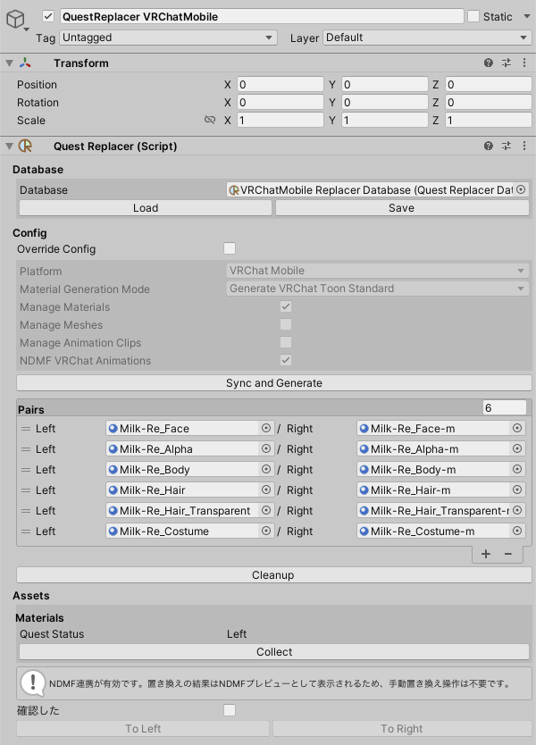

# QuestReplacer

アバターに含まれるマテリアルなどのリソースの参照を置き換えパターンベースで破壊的または非破壊的に差し替えるツールです。

## できること

- Materialへの参照を差し替える
- Meshへの参照を差し替える
- 差し替え元と差し替え先の対応関係をデータベースに記録する
- 差し替え元と差し替え先の対応関係をアバターに記録したり、データベースに基づき自動で設定する
- 差し替え用のMaterialがない場合に自動生成する
  - Shaderを差し替えたMaterialが生成されますが、色味の調整は必要です
- 差し替えはいつでも手動実行できます

## できないこと

- 既存のボーンやGameObjectをEditorOnlyにする
- 既存のボーンやGameObjectに刺さっているコンポーネントを改変したり、追加・削除する
- 既存のMaterialやMeshを改変する
