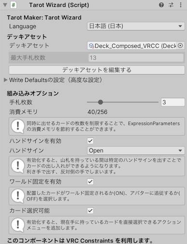
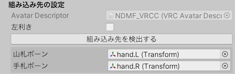
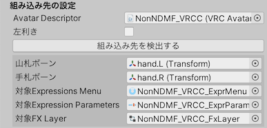
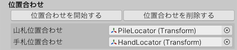
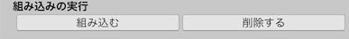

# インストール

## 大まかなフロー

Modular Avatarを使用して、または使用せずにインストールできます。

### Modular Avatarを使用する場合（推奨）

1. Tarot Wizard をアバターの子に追加する
2. 組み込みオプションをお好みに設定する
3. 組み込み先の検出をして、必要に応じて調整する
4. 位置合わせを行う

### Modular Avatarを使用せずに組み込む場合

1. Tarot Wizard をシーンに追加する
2. 組み込みオプションをお好みに設定する
3. 組み込み対象のAvatarDescriptorを設定する
4. 組み込み先の検出をして、必要に応じて調整する
5. 位置合わせを行う
6. 組み込みを行う

:::warning[WARNING]
Modular Avatarを使用せずに組み込む場合、アバターのアセットを破壊的に改変します。

* Modular Avatarを使用しない場合、アバターのFXレイヤー、ExpressionsMenu、ExpressionParameterは事前に作成しておく必要があります。
  いずれかが空である場合、組み込みは動作しません。
* 「組み込み」ボタンを押した際、Tarot Makerが管理する既存の設定がアバターから削除されます。
  Tarot Makerが管理するとみなされる設定は名前で識別され、 [内部仕様](4_deck.md) で定義されます。
:::

## ステップ

### Tarot Wizard を追加する

以下の方法で、 Tarot Wizard オブジェクトをシーンに追加してください。

- （推奨） Tarot Wizard 設定済みプレハブをヒエラルキーに追加する
- 空のGameObjectをシーンに追加して、`Tarot Wizard` コンポーネントを追加した上で、デッキアセットを設定する

Modular Avatar を使用する場合は、 Tarot Wizard オブジェクトをアバターの子に追加することでビルド時に非破壊で組み込まれます。

### 組み込みオプション

#### `Write Defaultsの設定`

ここを切り替えた場合、デッキアセットのWrite Defaultsが直接書き換わります。
Write Defaultsの有効化を前提とするアバターセットアップへの対応が改善される場合があります。

初期状態ではOFFです。

#### `手札枚数` | `Hand Count`

Tarot Makerで同時に取り出すカードの枚数に応じてExpression Parameterのメモリ消費量が増加します。

同時に出せるカードの枚数を制限することで、ExpressionParametersの消費メモリを節約することができます。
1枚以上、デッキアセットごとに指定された最大値まで設定できます。

また、ギミックが使用する消費メモリが表示されます。

:::info[INFO]
カードを取り出すシステムを動作させるために容量を16、更に取り出すカード1枚につき容量を8消費します。
容量の最大値は256なので、同時に取り出せるカードの枚数は理論上は30枚となります。

現実的には負荷の問題があるため、より少ない枚数を設定することを推奨します。
:::

#### `ハンドサインを有効` | `Hand Sign Enabled`

有効化すると、山札を持っている間は特定のハンドサインを出すことでカードの出し入れができるようになります。
利き手で出し、反対側（山札を持っている方）の手でしまいます。
環境によっては誤動作しやすくなるので気を付けてください。

#### `ワールド固定を有効` | `World Fixed Enabled`

配置したカードがワールド固定されるか(ON)、アバターに追従するか(OFF)を選択します。

#### `カード選択可能` | `Face Select Enabled`

有効化すると、現在手に持っているカードを直接選択できるアクションメニューを追加します。

### 組み込み先の検出

「組み込み先を検出する」ボタンを押すことで、アバターの両手のボーンを検出します。

Modular Avatarを使用せずに組み込む場合、対象のアバターの Avatar Descriptor を指定してください。

アバターのFXレイヤー、ExpressionsMenu、ExpressionParameterを追加で検出します。

Tarotメニューをサブメニューに格納したい、カードを指先に追従させたい、右足でカードを引きたいなどのカスタマイズを行う場合は、検出された値を手動で調整してください。

#### `左利き` | `Is Left Handed`

ON にした場合、左利きになります。（左手で手札を持ち、右手で山札を持ちます）

OFF の場合、右利きになります。（右手で手札を持ち、左手で山札を持ちます）

:::info[INFO]
Modular Avatarを使用して組み込む場合、Tarotメニューのインストール位置は自動的にアクションメニューのトップレベルが指定されます。
:::

### 位置合わせ

「位置合わせを開始する」ボタンを押すと、 `PileLocator` および `HandLocator` がアバターの手の位置に出現します。
これらのオブジェクトの位置を動かすことで、山札と手札を持つ位置を調整できます。
ヒエラルキーの階層関係を変更する必要はありません。
見た目上の位置を合わせることで、組み込まれたカードは追従先のボーンに追従します。

### 組み込み

Modular Avatar を使用する場合、ギミックはアバタービルド時に非破壊で組み込まれます。

Modular Avatar を使用しない場合、 「組み込む」ボタンを押してギミックをアバターに組み込むか、「削除する」ボタンを押してギミックをアバターから取り除きます。
自作したデッキアセットをリビルドした際は、リビルドされたデッキアセットの内容をアバターに反映するために、改めて「組み込む」ボタンを押してください。
