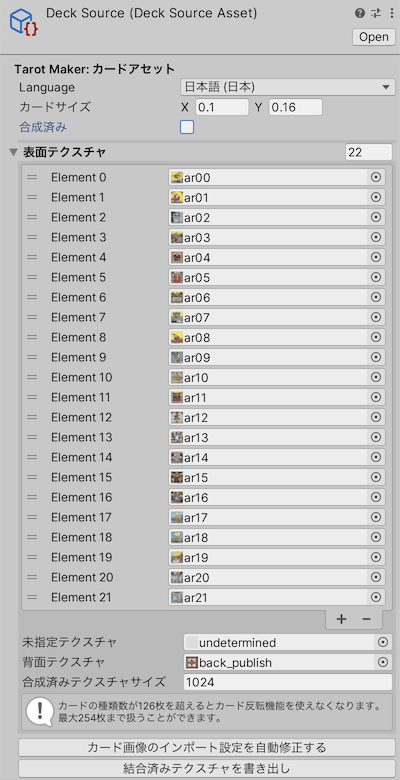
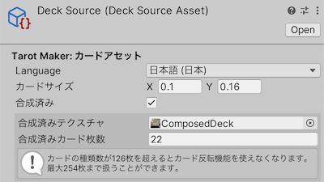

# カードアセット

カードアセットについて説明します。

:::info[INFO]
※以下の方法でカードアセットを自作するには、 Tarot Maker フルセットが必要です。
:::

## カードアセット | Deck Source Asset

カードアセットはデッキに組み込むカード画像の設定ファイルです。

「Assets」→「Silksprite」→「TarotMaker Deck Source Asset」 からカードアセットを作成します。

カードアセットはデッキアセットをビルドする際に利用します。
ビルドされたデッキアセットをアバターに組み込む段階では、カードアセットは不要です。
（Missingでも大丈夫です。）

### 個別のカード画像を合成する場合

以下のカード画像を個別の画像ファイルとして用意した上で、カードアセットのインスペクタから値を設定してください。

カード画像の縦横比はなるべく統一してください。統一されていない場合、カード画像が引き伸ばされて変形します。

`結合済みテクスチャを書き出し` ボタンをクリックすることで、設定内容を合成済みのカード画像に変換できます。

#### `カードサイズ` | `Card Size`

カードの縦横比を指定します。

#### `表面テクスチャ` | `Face Textures`

カード表面画像を指定します。 
カード表面の枚数分指定してください。

最大126枚のカードを登録できます。
登録枚数が126枚を超えた場合、カード反転機能は無効化されます。
その場合、枚数の上限は254枚になります。

#### `未指定テクスチャ` | `Undetermined Texture`

未確定のカード表面画像を指定します。
これはまだ引いていないカードの絵柄が見えないようにするためのものです。

#### `裏面テクスチャ` | `Back Texture`

カード裏面画像を指定します。

#### `合成済みテクスチャサイズ` | `Composed Texture Size`

合成されるテクスチャ画像の解像度を指定します。

### 合成済みのカード画像を使用する場合

既に Tarot Maker によって合成済みのカード画像を流用する場合、カードアセットの `Is Composed` をセットすることで選択が可能です。

#### `カードサイズ` | `Card Size`

カードの縦横比を指定します。

#### `合成済みテクスチャ` | `Composed Texture`

合成済みのテクスチャ画像を指定します。

#### `合成済みカード枚数` | `Composed Face Count`

合成済みのテクスチャに含まれるカード表面の枚数を指定します。

