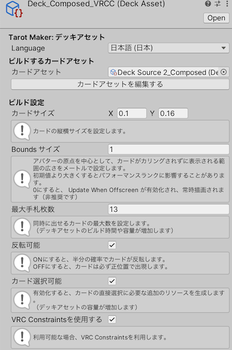
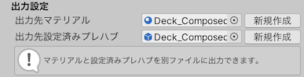
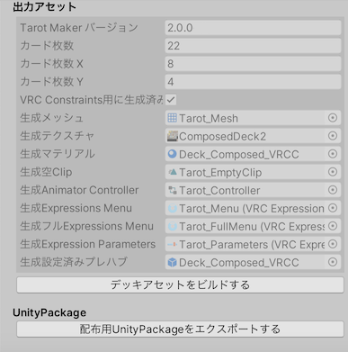

# デッキアセット

デッキアセットについて説明します。

:::info[INFO]
※以下の方法でデッキアセットを自作するには、Tarot Makerフルセットが必要です。
:::

## デッキアセット | Deck Asset

デッキアセットはギミックが直接利用するアセットをまとめたアーカイブです。

「Assets」→「Silksprite」→「TarotMaker Deck Asset」 からデッキアセットを作成します。

### デッキアセットの設定

#### `カードアセット` | `Deck Source Asset`

カードアセットを指定します。

#### `カードサイズ` | `Card Size`

カードの縦横比を指定します。

#### `Boundsサイズ` | `Bounds Size`

１枚目のカードを中心として、その他のカードがカリングされずに表示される範囲の広さを設定します。
ここで設定した数値メートル分まで離れられますが、初期値より大きくするとパフォーマンスランクに影響することがあります。
0にすると、Skinned Mesh RendererのUpdate When Offscreenが有効化され、常時描画されます（非推奨です）。

#### `最大手札枚数` | `Hand Count Max`

同時に出せるカードの最大数を設定します。
初期値は14で、設定可能な最大値は30です。

:::warning[WARNING]
初期値より大きい値を設定した場合、デッキアセットのビルド時間やダウンロード容量、実行時のメモリ消費量や処理負荷が著しく増加します。
:::

#### `反転可能` | `May Reverse`

ONにすると、半分の確率でカードが反転します。

OFFにすると、カードは必ず正位置で出現します。

#### `カード選択可能` | `Face Select Enabled`

有効化すると、カードの直接選択に必要な追加のリソースを生成します。
（デッキアセットの容量が増加します）

#### `VRC Constraintsを使用する` | `Use VRC Constraints`

有効化すると、Unity標準のConstraintsの代わりにVRC Constraintsを使用するデッキアセットを生成します。

### 出力先設定

#### `出力先マテリアル` | `Output Material`

設定した場合、マテリアルをデッキアセットに含めず、別ファイルに出力できます。

#### `出力先設定済みプレハブ` | `Output Deck Prefab`

デッキアセット設定済みプレハブの出力先を指定します。

### デッキアセットをビルドする

「デッキアセットをビルドする」を押すことで、デッキアセットに上記の設定内容が反映されます。

## unitypackageエクスポート

デッキアセットを他のプロジェクトのアバターに組み込むためのunitypackageをエクスポートします。

unitypackageには以下のものが含まれます。

- デッキアセット
- デッキアセットをアバターに組み込むためのスクリプト
- （存在する場合）別ファイルに出力されたマテリアル
- （存在する場合）デッキアセット設定済みのプレハブ
- （使用している場合）合成済みのカード画像

Tarot Makerフルセットを所有している場合、unitypackageを配布できます。
