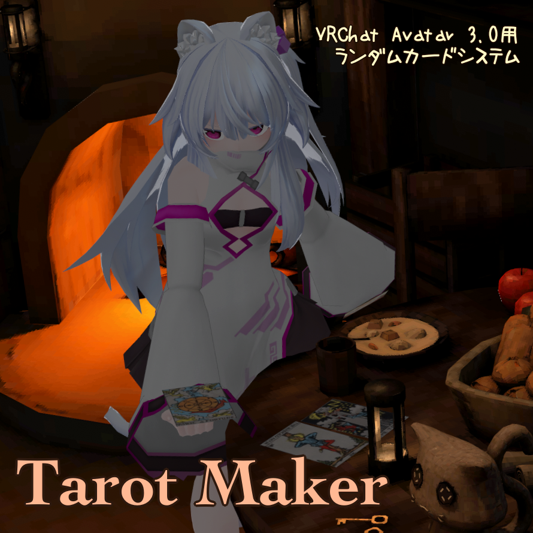
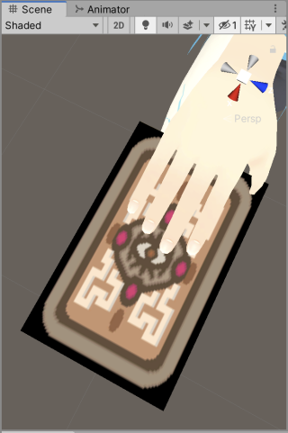

# Tarot Maker

Tarot Maker - Silksprite Satellite - BOOTH
https://booth.pm/ja/items/3676743

## これは何？

重複なしでランダムに複数枚のカードをデッキから引けるアバター用のギミックです。
引いたカードは他のプレイヤーに同期し、ワールドまたは自分自身への固定が可能です。
アバターへの組み込みはスクリプトの力でサポートされます。

### Tarot MakerフルセットとTarot Makerサンプルアセットの違い

Tarot Makerサンプルアセット利用者は以下の行為が可能です。

- 大アルカナをランダムに引くギミックをアバターに組み込むことができます。
- 上記のギミックで利用するテクスチャおよびマテリアルを改変できます。
- その他のギミック改変も自己責任で行えますが、サポートしません。

Tarot Makerフルセット利用者は以下の行為が可能です。

- 任意の枚数のカードをランダムに引くギミックを作成し、アバターに組み込むことができます。
- 任意の枚数のカードをランダムに引くギミックをアバターに組み込むためのunitypackageを出力できます。
  - このunitypackage、またはそれと同等の内容を再配布できます。

## 動作環境

Tarot MakerはVRChat用アバターの改変ツールです。

Tarot Maker 2.0.0 は以下の環境で動作を確認しています。

- Unity 2022.3.22f1
- VRChat SDK - Avatars 3.7.0
- Non-Destructive Modular Framework 1.4.1
- Modular Avatar 1.9.15

最新版でも多くの場合動くと思います。

## 制限事項

**Tarot Makerは同時に取り出すカードの枚数に応じてExpression Parameterのメモリを大量に消費します。**
Expression Parameterを全て消費して最大30枚まで表示可能ですが、現実的にはそれ以下の枚数となります。あらかじめご了承ください。

**Tarot Makerのカード画像は１枚のテクスチャに合成されます。**
この性質上、カードの種類を増やせば増やすほど解像度が低下しますので注意してください。

**Tarot Makerの全てのカードが単一のSkinnedMeshRendererで表示されるため、カード間の距離が離れすぎるとカリングされて見えなくなる場合があります。**
Boundsのサイズ指定にて調整できますが、大きすぎる場合パフォーマンスランクに影響が出ることがあります。

**ワールドに後からJoinしてきた人には設置されたカードの位置が同期されません。**
これは、Constraintを用いてワールド固定を実現しているための制限になります。

## 利用条件

本アセットはVN3ライセンス にて配布しております。利用の際は利用規約を遵守してください。

Tarot Makerフルセットのバージョン 2.0.0 には、Tarot Maker利用規約 バージョン 2.0.0 が適用されます。
正式なライセンス文書は同梱されているPDFファイルを参照してください。

## 更新履歴

- 2022/2/22 Tarot Maker 1.0.0 公開。
- 2022/2/26 Tarot Maker 1.0.1 更新。
  - 動作速度の向上、負荷の軽減を行いました。
  - バージョン 1.0.1 にはカードの表示ロジックに不具合がありました。 1.0.2 で修正されました。
- 2022/2/27 Tarot Maker 1.0.2 更新。
  - 不具合の修正を行いました。
- 2024/9/23 Tarot Maker 2.0.0 更新。
  - Modular Avatarに対応しました。
  - VRC Constraintを利用した場合、Quest用アバターで動作するようになりました。
  - 最低動作環境がUnity 2022 以上になりました。Tarot Maker 1.xはUnity 2022 に非対応です。

(c) kaikoga 2022-2024.
