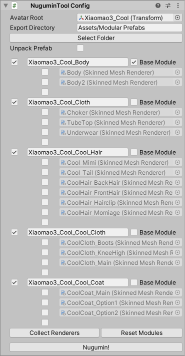

# Modularizer (a.k.a. NuguminTool)

See https://kaikoga.booth.pm/items/5077401

VPM https://vpm.kaikoga.net/

Modular Avatar https://modular-avatar.nadena.dev/ja/

## 使い方

1. アバターを選択して 「GameObject」→「NuguminTool」→「NuguminTool Config」 か
   「Component」→「NuguminTool」→「NuguminTool Config」
2. Avatar Root にアバターが入ってなかったら設定してください
3. Export Directory を変える場合は「Select Folder」で選択します
4. 「Unpack Prefab」にチェックをつけるとUnpack Prefabされます
5. このままだとアバターがマテリアルごとに分解されるので、
   どのメッシュをまとめるかをリストで編集する
   - 「＋」　チェックをつけたMeshで新しいモジュールを作る
   - 「↑」　チェックをつけたMeshを上のモジュールにマージする
   - 「↓」　チェックをつけたMeshを下のモジュールにマージする
6. 分解方法を決めたら「Nugumin!」ボタンを押す
